# ActiveNet

## Abstract
Our work builds on the idea to formulate a pipeline which can detect levels of activeness in real-time, using a single RGB image of a target person. It expands the aim to create a generalized solution which works under any/most configurations, be it in an interview, online class, security surveillance, et cetera.\
We introduce a novel pose encoding technique, which encodes the 2-Dimensional keypoints extracted using Human Pose Estimation (HPE) algorithm.\
Our alerting mechanism is wrapped around the whole approach; it provides a solution to inhibit low-activeness by sending notification alerts to individuals involved.

##### ActiveNet Multi-Stage Mechanism
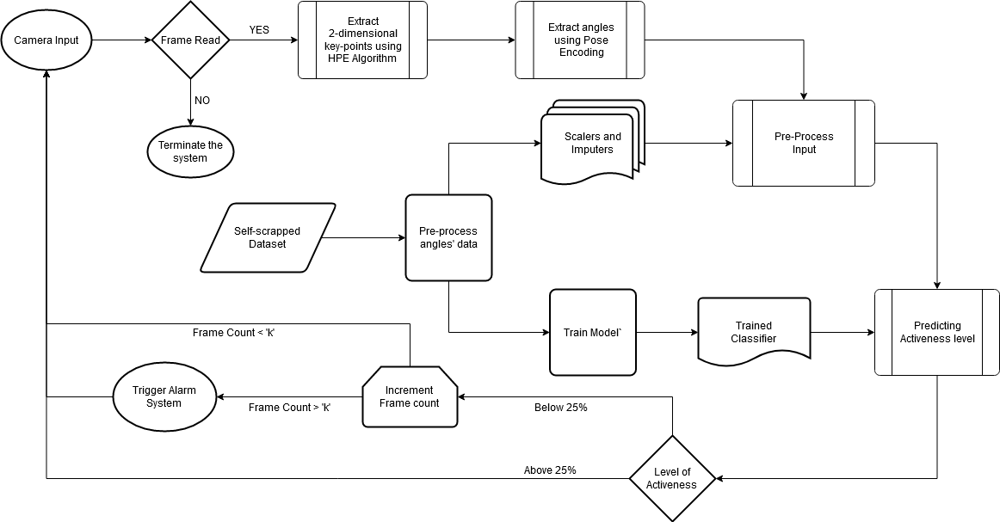

##### Alert Mechanism
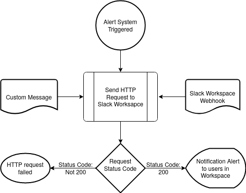

## Hardware Requirements
The pipeline can be run on a CPU, as well as on a dedicated GPU. We recommend using a dedicated GPU to achieve our framerate of ~35fps with a single Nvidia GeForce GTX 1650 graphics card.

## Dependencies Required
1.	Anaconda
2.	Python3
3.	PyTorch
4.	scikit-learn
5.	OpenCV

NOTE: Dependencies can either be installed individually, or a GPU enabled Anaconda environment can be created from the environment file using the following instructions:

## Execution Instructions
```
conda env create -f ActiveNet_Environment.yml
conda activate ActiveNet
python demo.py --source <filename or 0 for webcam>
```
NOTE: To run the demo on CPU, add extra flag --cpu to the above command.

#### Read [SLACK_WORKSPACE.md](SLACK_WORKSPACE.md) for information regarding the incoming webhooks.

## Screenshots
##### Above 75% Activeness Level Prediction
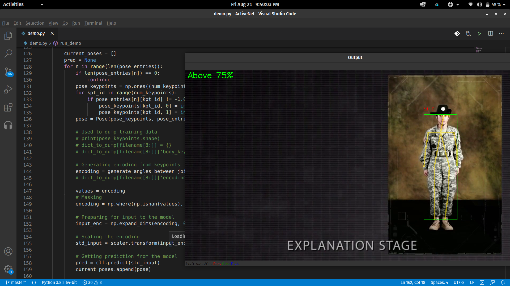
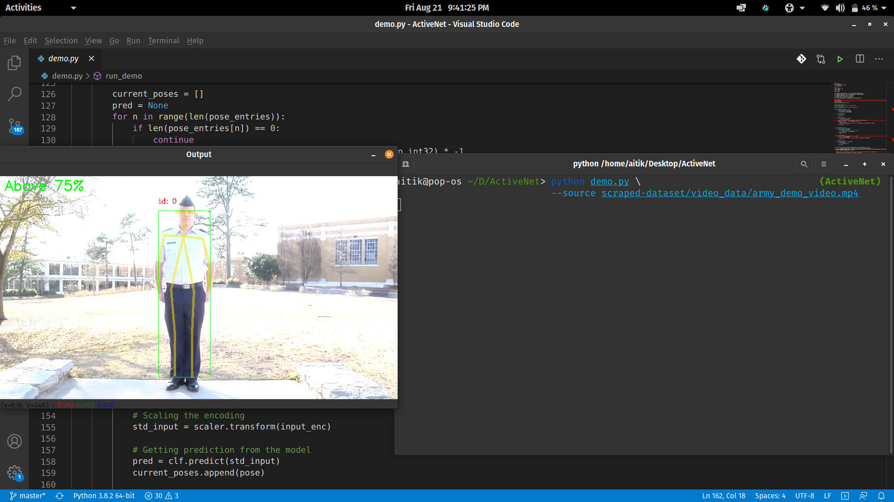

##### Between 50% and 75% Activeness Level Prediction
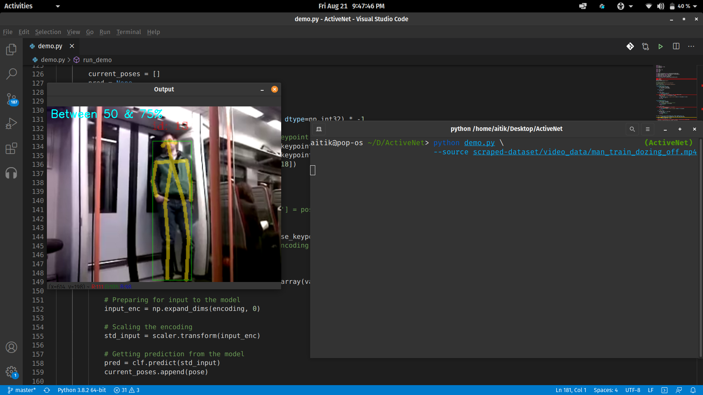

##### Between 25% and 50% Activeness Level Prediction
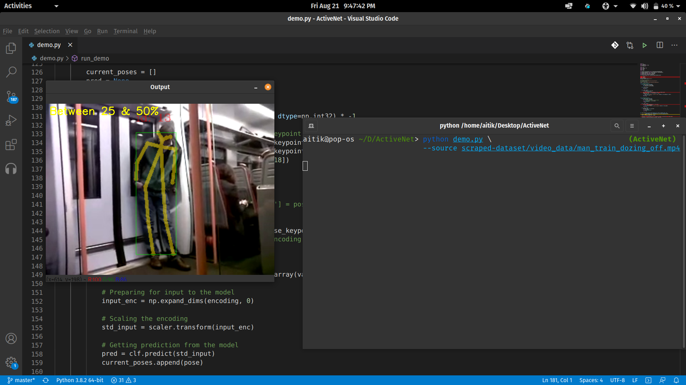
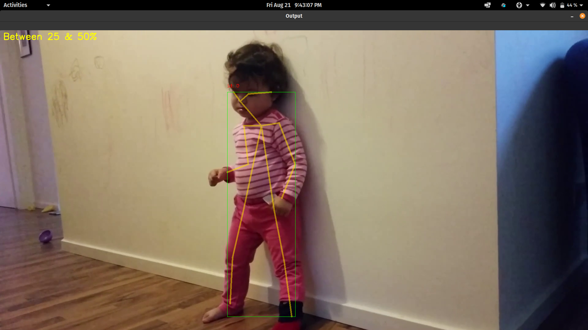

##### Below 25% Activeness Level Prediction
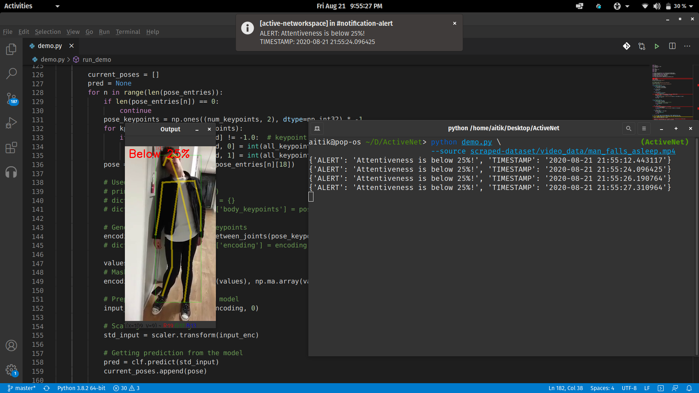
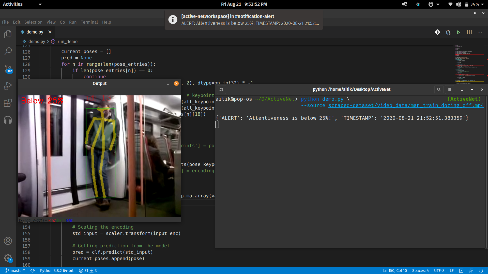

##### Notification Alert for Below 25% Activeness Level on Desktop
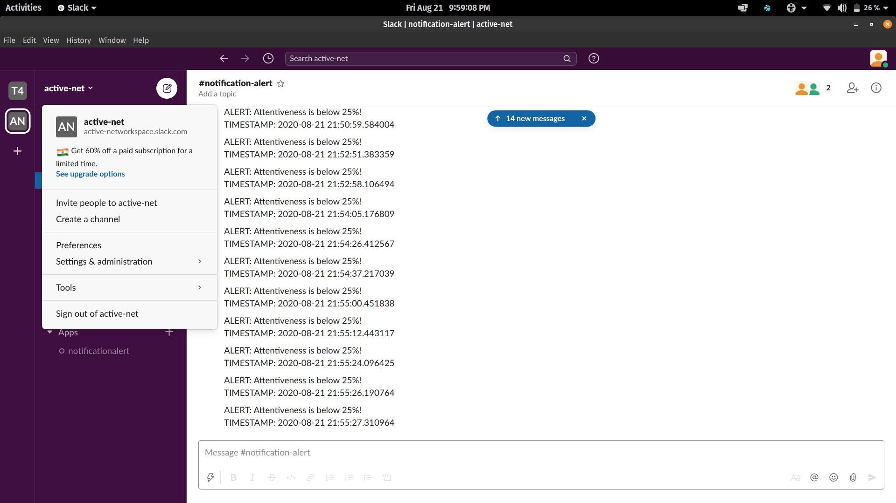

##### Notification Alert for Below 25% Activeness Level on Mobile Device
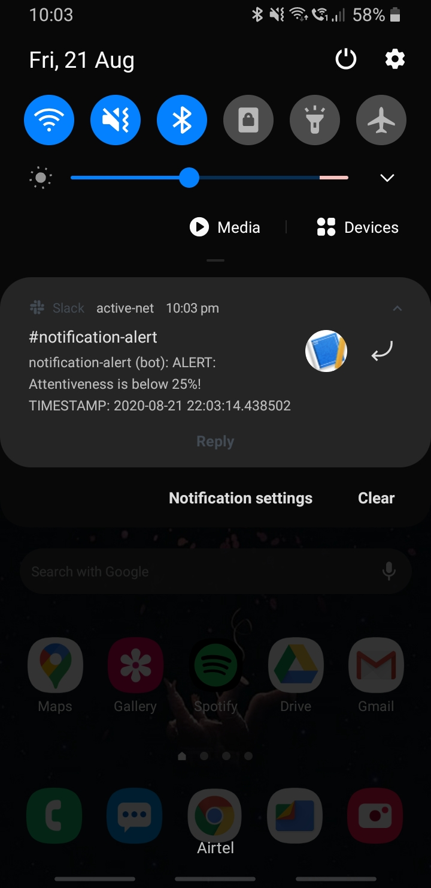

## Contributors
1.	[Aitik Gupta](https://github.com/aitikgupta)\
	ABV-IIITM, Gwalior\
	aitikgupta@gmail.com
2.	[Aadit Agarwal](https://github.com/aaditagarwal/)\
	ABV-IIITM, Gwalior\
	agarwal.aadit99@gmail.com